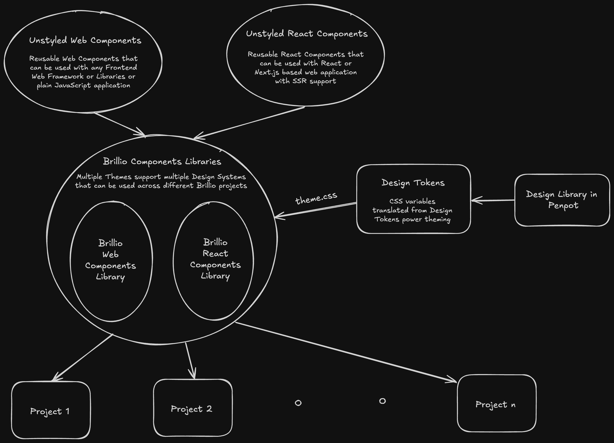

# Usage instructions for Brillio React Components

To get started, run the following commands from your React application and import individual components independently.:

```shell
npm install --save @brillio-dev/react-components
```

## Architecture


